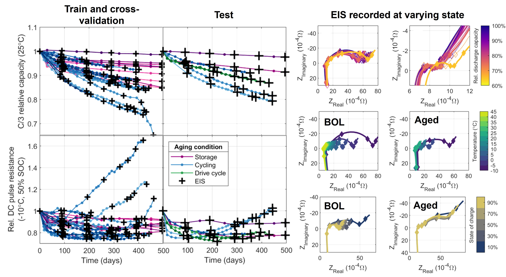
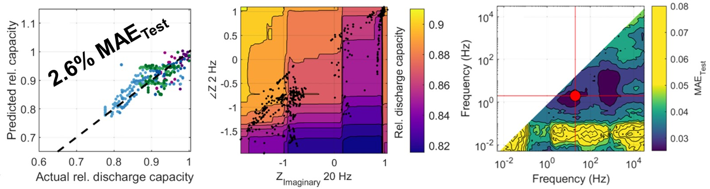

# Predicting battery capacity from impedance at varying temperature and state-of-charge using machine-learning

Paul Gasper1,*, Andrew Schiek1, Kandler Smith1, Yuta Shimonishi2, Shuhei Yoshida2

1 National Renewable Energy Laboratory, Golden, CO, USA

2 DENSO CORPORATION, Kariya, Aichi, Japan

* Corresponding author: Paul.Gasper@nrel.gov, pauljgasper@gmail.com

This repository provides the data and code used in the work "Predicting battery capacity from impedance at varying temperature and state-of-charge using machine-learning". This work uses machine-learning to develop models predicting battery capacity from impedance recorded at varying temperature and state-of-charge from 32 large-format NMC/Gr Li-ion batteries throughout the course of a 500-day aging study. The data set is comprised of a total of 727 electrochemical impedance spectroscopy (EIS) measurements, 622 DC internal resistance measurements, and 1216 capacity measurements. Further information on the aging study and observed degradation trends is reported in [Smith et al, (2021) JES *168* 100530](https://iopscience.iop.org/article/10.1149/1945-7111/ac2ebd/pdf).

Modeling is performed in MATLAB, with some data processing conducted using Python. A wide variety of feature engineering approaches with mutliple types of regression models are searched to find the optimal modeling approach, using a machine-learning pipeline approach in the style of the Python library sklearn, automating the investigation of thousands of potential models. Model performance is evaluated using both cross-validation within the training set (about 70% of the data) and testing on held-out data (about 30% of the data). An example result below uses impedance data from just two frequencies as inputs to a random forest model, trained using weights to help correct the model for imbalance of the data set, acheiving 2.6% mean absolute error on unseen data (left axes below). Models were interrogated with a variety of approaches, such as partial dependence (middle axes). The exhaustive search for the best model using any two frequencies helps inform rules for selecting frequencies that are sensitive to battery health but tolerant to the variation of temperature and SOC, suggesting that impedance near 100 Hz and 103 Hz is most effective for this data set; this approach could easily be replicated for other data sets to determine critical frequencies for other battery formats or chemistries. The best result achieves an error of 1.9% on test data using an ensemble of linear, GPR, and RF models.

## Repository structure and MATLAB file order

Paper figures and results can be replicated by running the associated MATLAB files in order. Python code for ECM modeling and ANN training are included in the python folder, but do not need to be run, as the outputs are saved and uploaded in the repository. A csv of just the data used for modeling after all data processing steps is saved at 'data/data.csv' (some capacity and DCIR measurements not used for modeling are used for data exploration).

- README.md: this document
- example_Denso_models.m: Replicates some of the more interesting models detailed in the paper and visualizes results. This is the most useful file for rapidly investigating the data and understanding/replicating this work.
- explore_Denso_data.m: Explores the data, creating many of the data exploration plots reported in the paper.
- model_Denso_data.m: Trains, cross-validates, and tests many thousands of possible models (takes many hours). Result files may be several GB.
- data: Data files from both this work and prior work by [Zhang et al (2020)](https://www.nature.com/articles/s41467-020-15235-7.pdf), and MATLAB scripts for processing the data files into a machine-learning ready format. Other data files are stored as '.mat' format.
- functions: Library of MATLAB functions used in this work.
- python: Jupyter notebooks running python code to train a neural network model and to fit equivalent circuit models to the EIS data used in this work.

## Requirements

- MATLAB R2020b with Statistics and Machine Learning Toolbox
- Python 3.7 (virtual environment defined in 'python/environment.yml')
- IDE compatible with Jupyter notebooks

## Other implementations
A similar approach is demonstrated using Python with the sklearn library  on the data from [Zhang et al (2020)](https://www.nature.com/articles/s41467-020-15235-7.pdf) at https://github.com/battery-data-commons/mrs-sp22-tutorial.

## Citation

Gasper P, Schiek A, Smith K, Shimonishi Y, and Yoshida S. (2022). _Submitted for publication._
